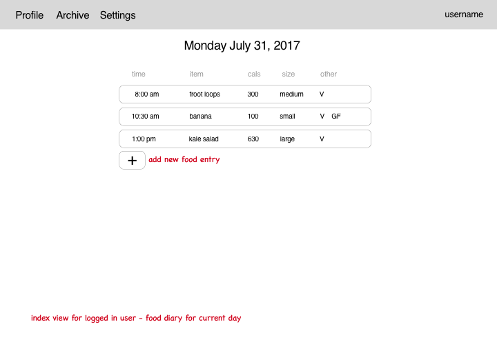
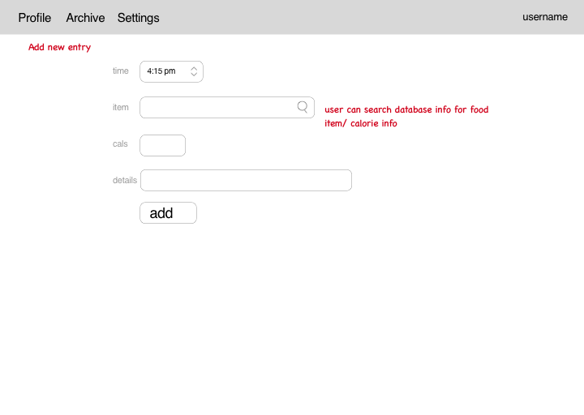

# Project 2 - Food Diary

By Julia Graves

### Description
This app allows users to sign in and keep a running record of everything they eat with calorie information. Users can search for an item they want to add to their food diary through the app, and it will return results with calorie data.


### Wireframes

Home Page


Main Food Diary



Adding an Item




### User Stories
When the user is on the home page (not logged in) they can either log in or register, then they will be redirected to the food log for the current day. This app requires the user to be logged in.

When the user is on their food diary page for today, they can add an item or view a specific item that has already been logged.

When the user is viewing specific food entry in their log, they can edit or delete the item.

When the user chooses to add an item they can either search for the item via the nutritionix database and select an appropriate result or enter the item manually.

When the user is in the archive they can view (but cannot edit) their food logs for the past 30 days.

When the user is viewing their stats, they can click on any of the past 12 months to view a line graph of the total calories eaten each day and the average daily calories consumed for that month.


### Technologies 
- HTML
- CSS
- EJS
- Javascript
- Node
- postgreSQL
- PG-Promise
- Model View Control structure

### APIs
- __Nutritionix:__ includes a large search engine containing nutrition information on foods.

### Modules
- ```express``` used for managing app routes.
- ```morgan``` logs HTTP requests.
- ```dotenv``` configures .env variables with app.
- ```pg-promise``` connects back-end database to app.
- ```nodemon``` allows code to run as changes are made without needing to restart manually.
- ```bcryptjs``` used for password encryption and comparison.
- ```body-parser``` parses the post request body.
- ```method-override``` used to change request methods on forms.
- ```cookie-parser``` parses cookies.
- ```passport``` authentication middleware.
- ```passport-local``` authentication middleware.
- ```express-session```  authentication middleware.
- ```ejs``` the templating engine used for this project.
- ```isomorphic fetch``` used for requests and promises.
- ```moment``` used for getting and formatting time and dates.
- ```chart.js``` used for displaying data in a line graph.
  

### Code Snippet

This is the code that renders the page with a graph with the stats for a selected month:

``` javascript
statsController.month = (req,res) => {
	var month = req.params.month
	var start = moment(`2017-${month}-01`).add(-1,'day').format('YYYY-MM-DD');
	var end = moment(start).add(1,'month').add(2,'day').format('YYYY-MM-DD');
	monthLen = 	 moment(`2017-${month}`,'YYYY-MM').daysInMonth();
	//gets average daily cals and  daily total calories for each day in given month 
	Stats.totalCals(req.user.id,start,end).then(totalCals => {
		Stats.allCals(req.user.id,start,end)
		.then(monthData => {
			//initialize datasets
			let cals = [];
			let dates = [];
			monthData.forEach((i) => {
				cals.push(i.daily_sum + '');
				dates.push(i.date);
			});
		//render month page and graph with data
		res.render('stats/month-table', {
			dates: formatDates(dates),
			cals: cals,
			avgCals: totalCals[0].sum/monthLen,
			currentPage: null,
			month: moment(`2017-${month}-01`).format('MMMM')
		});
	})

	}).catch(err => {
		console.log(err);
		res.status(500).json({error:err});
	});
}
```

### Improvements
I would ideally like to have the line graph display formatted dates on the X-axis instead of just the day number (i.e. 'Aug 31' instead of just '31'), and also have datapoints as 0 calories for days without entries so that days aren't skipped on the graph.

I also might add options for more fields the user can optionally track, like whether something is vegan or gluten-free.


### How to Run Locally
In order for the app to run, there must be a local database that has tables for users and food entries. The seed and migration files must have lines connecting them to the database before running the files. The app is run by calling ```npm run dev``` in the command line from the project directory. It will run on ```localhost:3000```. 


The technologies, APIs, and modules you used and a description of each
A code snippet of a part of the app you're particularly proud of
Any things you plan to fix or features you plan to add
Instructions for downloading the code and running it on localh
